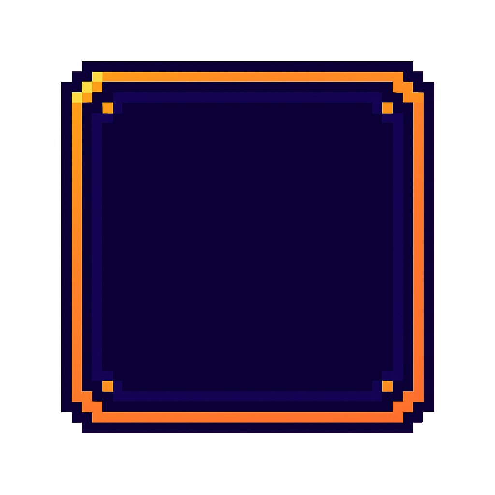
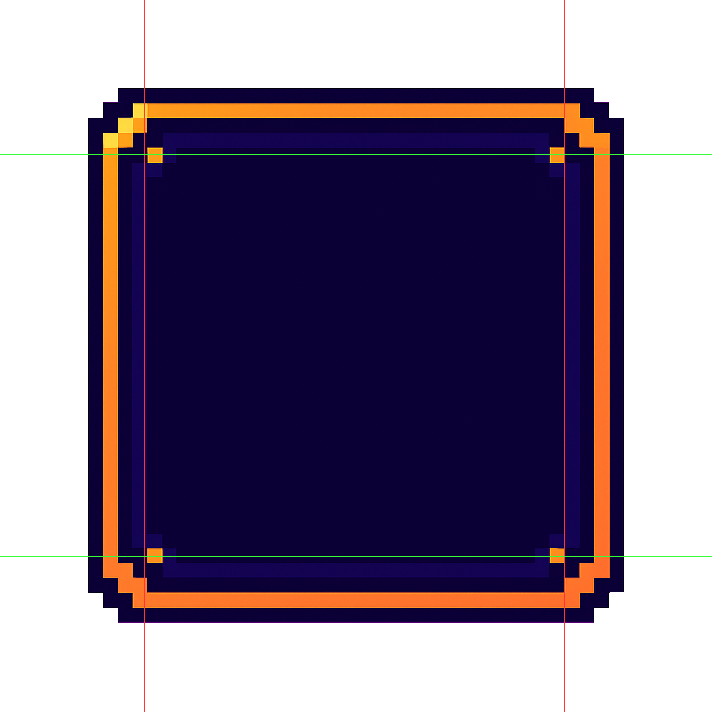
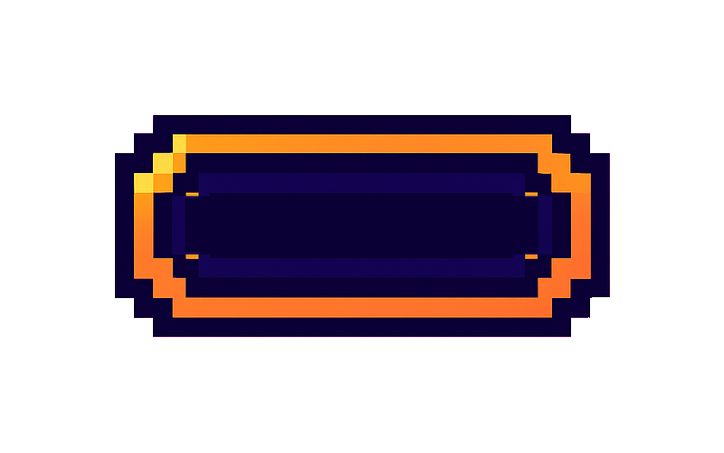
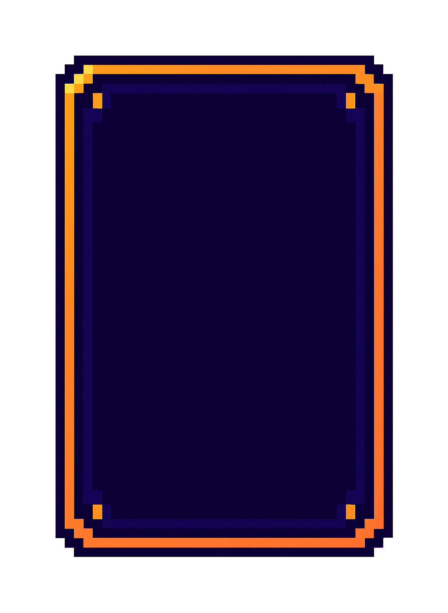
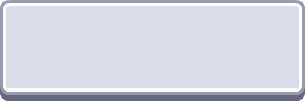
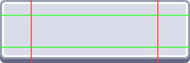
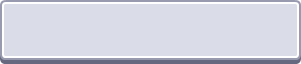
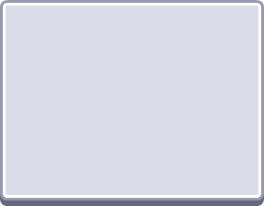

# deepslice

Auto [nine-patch](https://developer.android.com/develop/ui/views/graphics/drawables#nine-patch) slicer powered by ML. Feed it a UI element, get back stretchable regions — no manual slicing.

| Original | Detected Slices | Stretched Wide | Stretched Tall |
|:---:|:---:|:---:|:---:|
|  |  |  |  |
|  |  |  |  |

<sub>Button asset from [Kenney's UI Pack](https://www.kenney.nl/assets/ui-pack) (CC0)</sub>

## Install

```
brew tap stargazing-dino/deepslice
brew install deepslice
```

Or build from source:

```
cargo install --path .
```

## Usage

```bash
# Predict slice coordinates
deepslice image.png

# JSON output
deepslice image.png --json

# Visualize detected slice lines
deepslice image.png --visualize

# Stretch using predicted coordinates
deepslice image.png --stretch 800x500 -o stretched.png
```

## How it works

An EfficientNet-B0 model predicts four normalized coordinates (left, right, top, bottom) that define the stretchable region of a UI element. The model was trained on synthetic UI elements with curriculum learning — simple shapes first, then progressively adding shadows, gradients, and noise.

The model weights are embedded in the binary. No downloads, no config, no dependencies.

## Training

The training notebook lives in `training/train.ipynb` (designed for Google Colab with GPU). To convert a trained PyTorch model for use with the CLI:

```bash
uv run training/convert_model.py model.pt ninepatch_model.safetensors
```

## License

MIT
